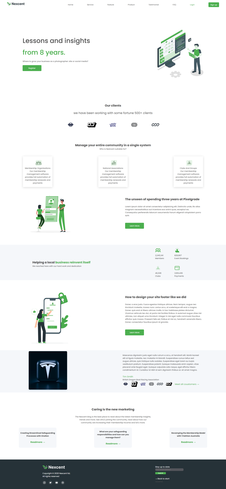

# Landing-page Nextcenter

Projeto realizado com a finalidade de aplicar meus conhecimentos de HTML e CSS.

## 🚀 Demonstração:

https://izabela-guimaraes.github.io/landing-page/
  

## =📌 Sobre o projeto

- A estilização do projeto foi realizada com Flexbox e técnicas de código limpo.
- Layout responsivo com animações.
- Animações desenvolvidas com keyframes.

## 🛠️ Tecnologias Utilizadas
* **HTML5:** Estrutura semântica.
* **CSS3:** Layout moderno com Flexbox, animações e responsividade.

## 🧠 Desafios Técnicos Superados

- Implementação de animação simulando digitação

👩‍💻 Autora

Desenvolvido por Izabela Guimarães

💼 GitHub: https://github.com/izabela-guimaraes